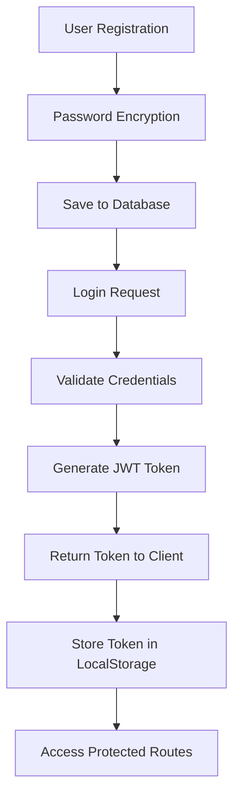
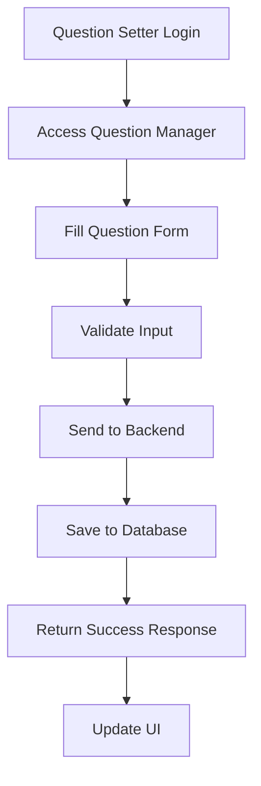
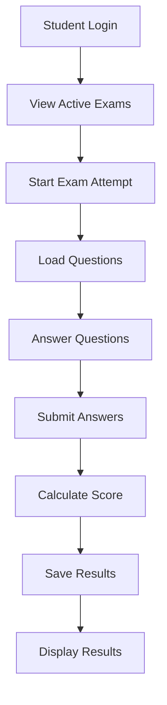

# StudySync - API Documentation & System Design

## 🌐 API Endpoints Overview

### **Authentication APIs**
```
POST /api/auth/register    - User registration
POST /api/auth/login       - User login
POST /api/auth/test        - Test authentication
```

### **Question Management APIs**
```
GET    /api/questions              - Get all questions
POST   /api/questions              - Create new question
PUT    /api/questions/{id}         - Update question
DELETE /api/questions/{id}         - Delete question
GET    /api/questions/user/{userId} - Get questions by user
```

### **Exam Management APIs**
```
GET    /api/exams                  - Get all exams
POST   /api/exams                  - Create new exam
PUT    /api/exams/{id}            - Update exam
DELETE /api/exams/{id}            - Delete exam
GET    /api/exams/active          - Get active exams
POST   /api/exams/{id}/activate   - Activate exam
POST   /api/exams/{id}/deactivate - Deactivate exam
POST   /api/exams/{id}/complete   - Mark exam complete
```

### **Exam Taking APIs**
```
GET    /api/exams/{id}/attempt     - Start exam attempt
POST   /api/exams/{id}/submit      - Submit exam answers
GET    /api/exams/results/{userId} - Get user's exam results
```

### **Forum APIs**
```
GET    /api/forum/questions        - Get all forum questions
POST   /api/forum/questions        - Post new question
GET    /api/forum/questions/{id}   - Get specific question
POST   /api/forum/questions/{id}/answers - Post answer
```

### **Analytics APIs**
```
GET    /api/analytics/exam/{id}    - Get exam analytics
GET    /api/analytics/dashboard    - Get dashboard statistics
```

## 🏛️ Database Schema

### **Users Table**
```sql
CREATE TABLE users (
    id BIGINT PRIMARY KEY AUTO_INCREMENT,
    username VARCHAR(50) UNIQUE NOT NULL,
    email VARCHAR(100) UNIQUE NOT NULL,
    password VARCHAR(255) NOT NULL,
    first_name VARCHAR(50) NOT NULL,
    last_name VARCHAR(50) NOT NULL,
    role ENUM('STUDENT', 'QUESTION_SETTER') NOT NULL,
    created_at TIMESTAMP DEFAULT CURRENT_TIMESTAMP
);
```

### **Questions Table**
```sql
CREATE TABLE questions (
    id BIGINT PRIMARY KEY AUTO_INCREMENT,
    question_text VARCHAR(1000) NOT NULL,
    option_a VARCHAR(255) NOT NULL,
    option_b VARCHAR(255) NOT NULL,
    option_c VARCHAR(255) NOT NULL,
    option_d VARCHAR(255) NOT NULL,
    correct_answer CHAR(1) NOT NULL,
    subject VARCHAR(100),
    difficulty_level VARCHAR(20),
    created_by BIGINT,
    created_at TIMESTAMP DEFAULT CURRENT_TIMESTAMP,
    FOREIGN KEY (created_by) REFERENCES users(id)
);
```

### **Exams Table**
```sql
CREATE TABLE exams (
    id BIGINT PRIMARY KEY AUTO_INCREMENT,
    title VARCHAR(200) NOT NULL,
    description TEXT,
    duration_minutes INTEGER NOT NULL,
    total_marks INTEGER NOT NULL,
    passing_marks INTEGER NOT NULL,
    status ENUM('DRAFT', 'ACTIVE', 'INACTIVE', 'COMPLETED') NOT NULL,
    created_by BIGINT,
    created_at TIMESTAMP DEFAULT CURRENT_TIMESTAMP,
    FOREIGN KEY (created_by) REFERENCES users(id)
);
```

### **Exam Attempts Table**
```sql
CREATE TABLE exam_attempts (
    id BIGINT PRIMARY KEY AUTO_INCREMENT,
    exam_id BIGINT NOT NULL,
    user_id BIGINT NOT NULL,
    answers TEXT, -- JSON format
    score INTEGER,
    total_questions INTEGER,
    correct_answers INTEGER,
    passed BOOLEAN,
    started_at TIMESTAMP,
    completed_at TIMESTAMP,
    FOREIGN KEY (exam_id) REFERENCES exams(id),
    FOREIGN KEY (user_id) REFERENCES users(id)
);
```

## 🔐 Security Architecture

### **JWT Token Structure**
```json
{
  "header": {
    "alg": "HS256",
    "typ": "JWT"
  },
  "payload": {
    "sub": "username",
    "userId": 1,
    "role": "STUDENT",
    "iat": 1632150000,
    "exp": 1632236400
  }
}
```

### **Role-Based Access Control**
```
STUDENT:
- ✅ Take exams
- ✅ View results
- ✅ Access forum
- ❌ Create questions
- ❌ Manage exams

QUESTION_SETTER:
- ✅ Create questions
- ✅ Manage exams
- ✅ View analytics
- ✅ Access forum
- ❌ Take exams
```

## 🔄 System Workflow

### **1. User Registration & Authentication**


### **2. Question Creation Workflow**


### **3. Exam Taking Workflow**


## 📊 Component Interaction Diagram

```
┌─────────────────┐    HTTP/REST    ┌─────────────────┐
│                 │◄───────────────►│                 │
│   React App     │    JSON Data    │  Spring Boot    │
│   (Frontend)    │                 │   (Backend)     │
│                 │                 │                 │
│  ┌─────────────┐│                 │┌─────────────┐  │
│  │ Components  ││                 ││ Controllers ││  │
│  └─────────────┘│                 │└─────────────┘  │
│  ┌─────────────┐│                 │┌─────────────┐  │
│  │ Services    ││                 ││ Services    ││  │
│  └─────────────┘│                 │└─────────────┘  │
│  ┌─────────────┐│                 │┌─────────────┐  │
│  │ State Mgmt  ││                 ││ Repositories││  │
│  └─────────────┘│                 │└─────────────┘  │
└─────────────────┘                 └─────────────────┘
                                             │
                                             │ JPA/Hibernate
                                             ▼
                                    ┌─────────────────┐
                                    │                 │
                                    │    Database     │
                                    │  PostgreSQL/H2  │
                                    │                 │
                                    └─────────────────┘
```

## 🎯 Technology Decisions

### **Backend Technology Choices**
- **Spring Boot**: Rapid development, extensive ecosystem
- **Spring Security**: Robust authentication & authorization
- **JWT**: Stateless authentication, scalable
- **JPA/Hibernate**: Object-relational mapping, database abstraction
- **PostgreSQL**: Production-grade relational database
- **H2**: In-memory database for development/testing

### **Frontend Technology Choices**
- **React**: Component-based UI, large community
- **React Bootstrap**: Responsive design, consistent UI
- **React Router**: Client-side routing
- **Axios**: HTTP client for API calls
- **React Icons**: Comprehensive icon library

## 🚀 Deployment Architecture

### **Development Environment**
```
Developer Machine
├── Frontend (React Dev Server) - Port 3000
├── Backend (Spring Boot) - Port 8080
└── Database (H2 In-Memory) - Embedded
```

### **Production Environment**
```
Production Server
├── Frontend (Nginx/Apache) - Port 80/443
├── Backend (Java JAR) - Port 8080
├── Database (PostgreSQL) - Port 5432
└── Load Balancer (Optional)
```

This comprehensive documentation provides a complete understanding of the StudySync system architecture, API design, and component interactions.